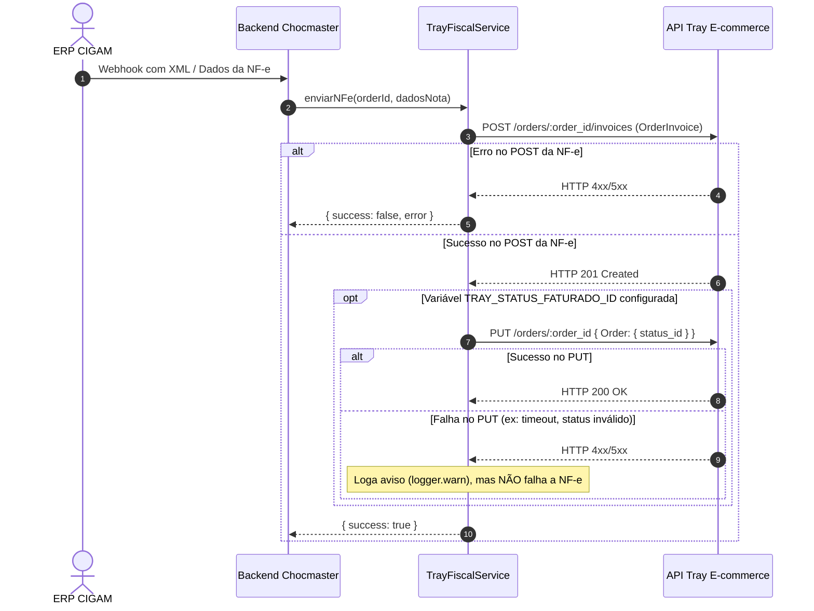

# Atualização de Status de Pedidos na Tray após Envio de NF-e

Este documento descreve a arquitetura, o fluxo de execução, os endpoints e a configuração para a transição de status de pedidos na plataforma **Tray E-commerce** após a emissão e envio da Nota Fiscal Eletrônica (NF-e) originada no **ERP CIGAM**.

---

## 1. Visão Geral e Contexto

No fluxo de integração entre o **CIGAM ERP** e os canais de venda (marketplaces e e-commerce), quando uma nota fiscal é faturada para um pedido da Tray, o CIGAM envia um webhook/chamada ao backend Chocmaster (`POST /api/v1/notas-fiscais-cigam`).

O backend Chocmaster encaminha a nota fiscal para a Tray através do serviço [`TrayFiscalService`](file:///c:/Users/geovani.santos/Desktop/Projetos%20Clientes/chocmaster/chocmaste-cigam/src/modules/tray/services/trayFiscalService.ts).

### Comportamento da API Tray
* **Registro de NF-e (`POST /orders/:order_id/invoices`)**: Responsável unicamente por associar os dados fiscais (número, série, chave de acesso de 44 dígitos, valor e data de emissão) ao pedido. **A API da Tray não transiciona o status do pedido automaticamente** ao receber essa chamada.
* **Atualização de Status (`PUT /orders/:id`)**: Rota oficial da Tray utilizada para transicionar o ciclo de vida do pedido, alterando o campo `status_id`.

---

## 2. Fluxo de Execução Implementado



### Resiliência e Tolerância a Falhas
A alteração de status é tratada de forma desacoplada do registro fiscal:
* Se o registro da NF-e for bem-sucedido na Tray, mas a requisição de mudança de status (`PUT /orders/:id`) falhar temporariamente, a operação é finalizada com **`success: true`**.
* Um log detalhado de aviso (`logger.warn`) é registrado no servidor.
* Isso evita reenvios que resultariam em conflito de duplicidade fiscal na Tray (`HTTP 409 Conflict` ou `HTTP 422 Unprocessable Entity`).

---

## 3. Catálogo de Status da Loja Tray Chocmaster

A loja Chocmaster (`store_id: 101757`) possui status padrão da plataforma e status customizados. A tabela abaixo lista os principais status relevantes para o fluxo de expedição e faturamento:

| ID (`status_id`) | Nome do Status | Tipo (Fluxo) | Descrição / Uso Sugerido |
| :---: | :--- | :---: | :--- |
| **`377`** | **NF EMITIDAS** | `open` | **Recomendado para NF-e**: Indica que a nota foi emitida e anexada ao pedido. |
| **`59`** | **ENVIADO** | `open` | Indica que o produto já foi despachado para entrega. |
| **`61`** | **ENVIADO A EXPEDIÇÃO** | `open` | Mover para a esteira de separação e expedição física. |
| **`64`** | **ENVIADO PARA EXPEDIÇÃO** | `open` | Variação customizada de expedição. |
| **`31`** | **AGUARDANDO ENVIO** | `open` | Faturado, aguardando coleta da transportadora / Correios. |
| **`69`** | **FINALIZADO** | `closed` | Status terminal de conclusão do pedido. |

---

## 4. Configuração no `.env`

Para ativar a transição automática de status, configure a variável `TRAY_STATUS_FATURADO_ID` no arquivo `.env` do backend:

```env
# ==========================================
# Tray API - Configurações de Faturamento
# ==========================================
# ID do status para o qual o pedido deve ser movido após o envio da NF-e.
# Exemplo: 377 para "NF EMITIDAS" ou 59 para "ENVIADO"
TRAY_STATUS_FATURADO_ID=377
```

> **Nota:** Se a variável `TRAY_STATUS_FATURADO_ID` for deixada vazia ou não informada, o sistema apenas registrará a NF-e no pedido sem alterar seu status atual.

---

## 5. Rotas e Scripts Utilitários

### 5.1. Script de Terminal (CLI)
Para inspecionar em tempo real todos os status da loja Tray conectada com seus respectivos IDs, execute:

```bash
npx ts-node --transpile-only -r tsconfig-paths/register scripts/list-tray-statuses.ts
```

### 5.2. Rotas REST no Backend Chocmaster

#### **Listar Catálogo de Status da Loja**
* **Método / Endpoint:** `GET /api/v1/tray/orders/statuses` (ou `/api/v1/tray/pedidos/statuses`)
* **Resposta de Exemplo:**
  ```json
  {
    "success": true,
    "data": {
      "OrderStatuses": [
        {
          "OrderStatus": {
            "id": "377",
            "status": "NF EMITIDAS",
            "type": "open",
            "background": "#CA2727"
          }
        },
        {
          "OrderStatus": {
            "id": "59",
            "status": "ENVIADO",
            "type": "open",
            "background": "#E7E7E7"
          }
        }
      ]
    }
  }
  ```

#### **Alterar Status de Pedido Manualmente**
* **Método / Endpoint:** `PUT /api/v1/tray/orders/:orderId/status` (ou `/api/v1/tray/pedidos/:orderId/status`)
* **Corpo (Payload):**
  ```json
  {
    "status_id": 377
  }
  ```
* **Resposta de Exemplo:**
  ```json
  {
    "success": true,
    "data": {
      "message": "Saved",
      "id": 1001,
      "code": 200
    }
  }
  ```

---

## 6. Arquivos Modificados / Criados

* [`src/modules/tray/services/trayFiscalService.ts`](file:///c:/Users/geovani.santos/Desktop/Projetos%20Clientes/chocmaster/chocmaste-cigam/src/modules/tray/services/trayFiscalService.ts): Implementação do disparo de atualização de status pós-envio de NF-e com tolerância a falhas.
* [`src/modules/tray/services/trayOrderService.ts`](file:///c:/Users/geovani.santos/Desktop/Projetos%20Clientes/chocmaster/chocmaste-cigam/src/modules/tray/services/trayOrderService.ts): Métodos `listarStatus` (com paginação) e `atualizarStatusPedido`.
* [`src/modules/tray/controllers/trayController.ts`](file:///c:/Users/geovani.santos/Desktop/Projetos%20Clientes/chocmaster/chocmaste-cigam/src/modules/tray/controllers/trayController.ts): Endpoints `listOrderStatuses` e `updateOrderStatus`.
* [`src/modules/tray/routes/tray.routes.ts`](file:///c:/Users/geovani.santos/Desktop/Projetos%20Clientes/chocmaster/chocmaste-cigam/src/modules/tray/routes/tray.routes.ts): Registro das rotas `/orders/statuses` e `/orders/:orderId/status`.
* [`scripts/list-tray-statuses.ts`](file:///c:/Users/geovani.santos/Desktop/Projetos%20Clientes/chocmaster/chocmaste-cigam/scripts/list-tray-statuses.ts): Utilitário de linha de comando para listar os status reais da loja conectada.
* [`.env.example`](file:///c:/Users/geovani.santos/Desktop/Projetos%20Clientes/chocmaster/chocmaste-cigam/.env.example): Documentação da variável `TRAY_STATUS_FATURADO_ID`.
* [`src/modules/tray/tests/trayFiscalService.test.ts`](file:///c:/Users/geovani.santos/Desktop/Projetos%20Clientes/chocmaster/chocmaste-cigam/src/modules/tray/tests/trayFiscalService.test.ts): Cobertura de testes unitários para a funcionalidade.
